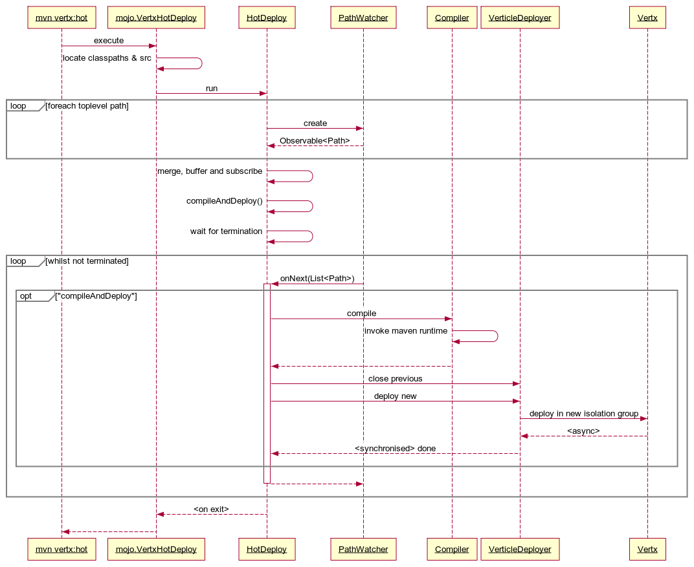

# vertx:hot
### Hot reloading of Vert.x Verticles for Maven and Buck
---

[](https://travis-ci.org/dazraf/vertx-hot)
[](https://gitter.im/dazraf/vertx-hot?utm_source=badge&utm_medium=badge&utm_campaign=pr-badge&utm_content=badge)

## Contents

1. [Background](#background)
2. [Aims](#aims)
3. [Instructions](#instructions)
4. [Example Project](#example-project)
5. [Design Notes](#design-notes)
6. [Contributors](#contributors)

## Background

[Vert.x](http://vertx.io) is an incredible toolkit for developing high-performance applications.

This plugin can speed up your dev cycle in popular build systems, such as Maven.

Write your code and see the changes auto reload into your JVM. Fully debuggable.

This plugin was originally written for personal use. Its shared here under the [MIT](https://opensource.org/licenses/MIT) licence.

Contributions most gratefully received and recognised.

## Aims

1. __Detect__ source changes
2. __`compile`__ stale targets
3. __Hot Reload__
4. __Full Debug__ without needing to attach to secondary processes
5. __Intuitive__ integration with Maven toolchain
6. __Fast__ at least much faster than using a manual workflow

## Maven Instructions

### Step 1: Download

Release versions of the Maven plugin are available in [Maven Central](http://search.maven.org/#search%7Cga%7C1%7Ca%3A%22vertx-hot-maven-plugin%22).
Snapshots are available in [Sonatype](https://oss.sonatype.org/content/groups/public/io/dazraf/vertx-hot-maven-plugin).
Zip'd releases are available [here](https://github.com/dazraf/vertx-hot/releases).

Please note: the latest version of the plugin depends on `vert.x 3.1.0`.

### Step 2: Add to your project
Add the following to your project `pom.xml`:

```
<plugin>
    <groupId>io.dazraf</groupId>
    <artifactId>vertx-hot-maven-plugin</artifactId>
    <version>2.1.0</version>
    <configuration>
        <verticleReference>class or service name</verticleReference>
        <configFile>config filename</configFile>
    </configuration>
</plugin>
```

The `configuration` has the following elements:

**Required**

* `verticleReference` - either the fully-qualified reference to the top-level verticle of your application or a [service reference](https://github.com/vert-x3/vertx-service-factory).

**Optional**

* `configFile` - the class path to the verticle configuration file. When loaded, `vertx:hot` will add the property `"devmode": true`.

* `liveHttpReload` - when `true`, all web pages served by the application verticles will auto reload 
  when any source is changed. `default: true`
  
* `buildResources` - when set to `true`, any change to files under the resource directories will trigger a `compile`. 
Use this if your resources generate sources. `default: false`

* `notificationPort` - websocket port for browser notifications. Used in conjunction with `liveHttpReload: true`. Default is `9999`. 

* `extraPaths` - list of additional paths to be watched. This has a list of `<extraPath>` elements. Example as follows:

```
<extraPaths>
  <extraPath>
    <path>specialPath/causesRedeploy.md</path>
    <!-- default -->
    <!-- <action>Redeploy</action> -->
  </extraPath>
  <extraPath>
    <path>specialPath/causesCompile.md</path>
    <action>Recompile</action>
  </extraPath>
  <extraPath>
    <path>specialPath/causesRefresh.md</path>
    <action>Refresh</action>
  </extraPath>
</extraPaths>
```

### Step 3: Run it

You can run it either on the command line with:

```
mvn vertx:hot
```

Or, in your favourite IDE: 

* __For any IDE__ you'll need a locally installed maven installation. Bundled / Embedded maven installations [do not work](https://github.com/dazraf/vertx-hot/issues/3).

* __IntelliJ IDEA__: 
  * *Run* - open the Maven side-bar, *expand* the `Plugins/vertx` section and *double-click* on `vertx:hot` goal. Any changes to your project's main source (*e.g.* `src/main`) will cause a hot deploy. 
  * *Debug* - *right-click* on the `vertx:hot` goal and *select* `Debug`.
  
* __Eclipse__:
  * *Run* - create maven build runner for `vertx:hot` goal. For Eclipse Mars on OS X, I found I had to set the JAVA_HOME environment variable in the runner. Once setup, `Run` it.
  * *Debug* - as above, but instead of `Run`, `Debug`

### Step 4: Stopping the plugin

Press either: `<Enter>` or  `Ctrl-C`.

## Example Project
There are two simple test project under `example1` and `example2`. 
The latter is an adaption of the excellent [ToDo App](http://scotch.io/tutorials/javascript/creating-a-single-page-todo-app-with-node-and-angular)
by [Scotch](http://scotch.io), with a vert.x reactive flavour.

To run either: 

1. You will need [bower](http://bower.io) on your path.
2. After running `mvn clean install` in the parent directory
3. `cd example1` or `cd example2`
4. `mvn vertx:hot`
5. Browse to [http://localhost:8888](http://localhost:8888)
6. Open up the project in your favourite IDE/Editor and try changing some code or static resources
7. The browser will automatically reload. The IDE/shell console will show the unload | recompile | reload activity.

## Buck Instructions

### Step 1: Get the jar

The vertx-hot-buck build produces a fat-jar, to make inclusion from Buck projects fairly simple.

A few dependencies have been excluded, either due to shading complexities or to improve flexibility:

* Vertx - likely already on your classpath. We build against 3.1.0, but more recent versions should be fine too.
* SLF4J - the logging API. Drop in `slf4j-api` and your chosen implementation. We build against 1.7.12, but again this should be fairly flexible.
* Buck - expected to reside on your PATH

If you're checking-in dependencies to your VCS, as per the recommended Buck methodology, then:

1. Store the vertx-hot-buck jarfile in your lib directory
2. Reference it using a `prebuilt_jar` rule:
```
prebuilt_jar(
  name = 'vertx-hot-buck',
  binary_jar = 'lib/vertx-hot-buck.jar'
)
```

If you fetch libraries from an m2 compatible repository, then you can include a corresponding `remote_file` rule to perform the fetch.

### Step 2: Add to your project

An easy way to configure a buck hot deploy target is with a dedicated main class.

You'll likely want to configure the logger:

```
System.setProperty("vertx.logger-delegate-factory-class-name", "io.vertx.core.logging.SLF4JLogDelegateFactory");
```

Then configure your hot deployment:

```
BuckHotDeployBuilder.create()
  .withBuildTarget("//my-service:bin")
  .withProjectRootPath(".")
  .withHotDeployConfig(new HotDeployParameters()
    .withBuildResources(true)
    .withCompileSourcePaths(asList("my-service/java"))
    .withNotificationPort(9588)
    .withVerticleReference("io.dazraf.myservice.MyVerticle")
  )
  .build()
  .run();
```

Executing the main method, with an appropriate classpath, will start the hot deployment.

The buck deployment parameters are:

**Required**

* `withBuildTarget` - The Buck [build target](https://buckbuild.com/concept/build_target.html) to invoke when a filesystem change is detected.

**Optional**

* `withProjectRoot` - a relative path to your project's root. Defaults to the present working directory.

* `withFetchMode` - if you'll be updating `remote_file` rules that need [fetching](https://buckbuild.com/command/fetch.html) before each build,
    you can set a non-manual `FetchMode`. At present, this uses a crude & inefficient implementation.

The hot deployment configuration options are described in the Maven installation instructions.

## Design Notes
 


## Contributors

With many thanks:

* [illuminace](https://github.com/illuminace)
